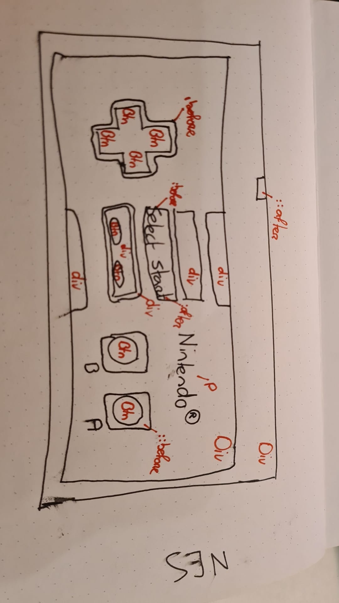
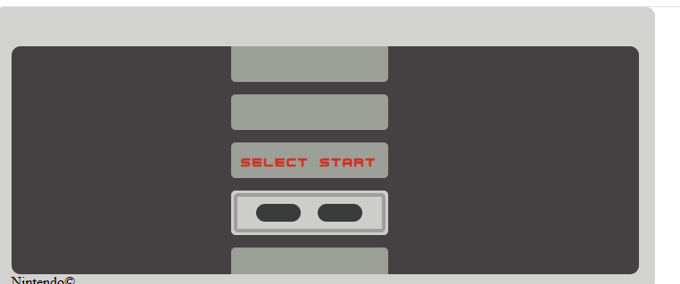
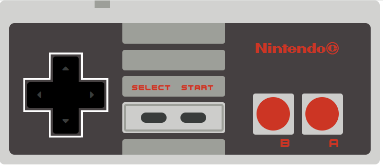

# Melvin-Web_Meesterschap-Blog

## NES Controller

### Donderdag 2 - 4 - 2026
Ik wilde vandaag alvast een begin maken aan mijn controller. Dus had ik alvast een eerste layout gemaakt. Ik heb wel alvast gekeken naar bepaalde fonts en heb de afmetingen van de controller ook overgenomen van een voorbeeld, die bronnen staan hieronder. Maar voordat ik was begonnen met coderen had ik hem eerst op papier uitgetekend zodat ik makkelijker aan kon geven welk element wat zou moeten zijn. Op deze manier kon ik mijn HTML meteen beter en schoon opzetten.

#### Bronnen
https://font.download/font/nes-controller 
https://www.dimensions.com/element/nes-controller 

### Zaterdag 4 - 4 - 2026
Vandaag heb ik de standaard styling van mijn NES controller afgemaakt. Alleeen het uiterlijk is redellijk klaar. Ik wil misschien later nog wat gradients toevoegen op de buttons om ze meer diepte te geven. Ook hebben ze nog geen active state. 

#### Bronnen
https://fontawesome.com/search?q=arrow&ic=free-collection 
https://www.fontspace.com/ro-spritendo-font-f83198 