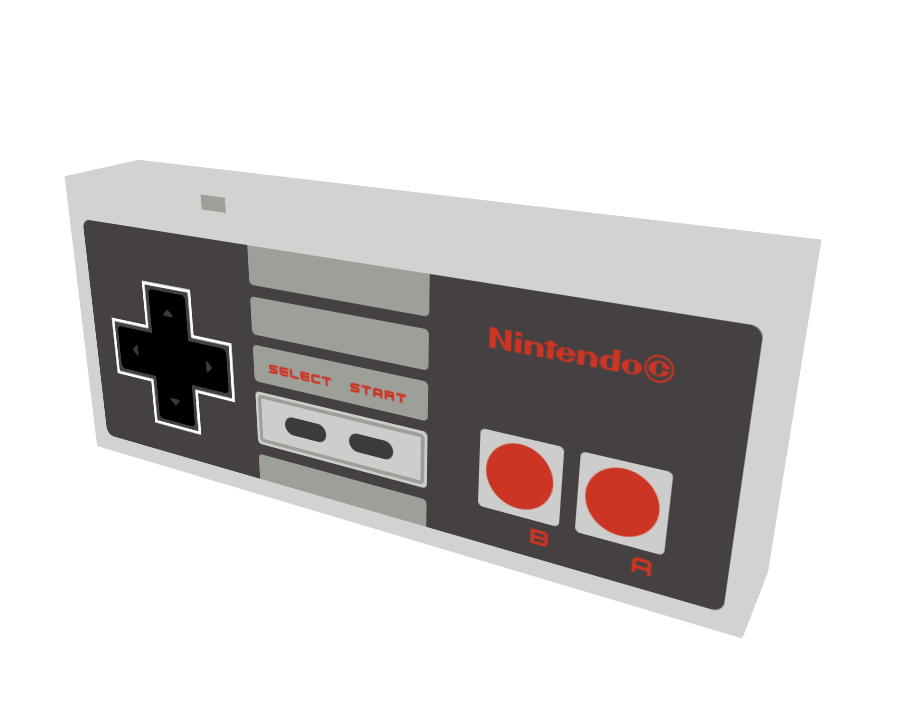
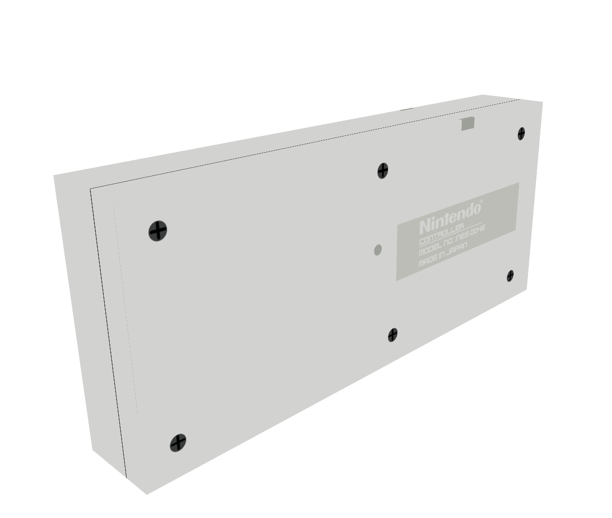

# Melvin-Web_Meesterschap-Blog

## NES Controller

### Donderdag 2 - 4 - 2026
Ik wilde vandaag alvast een begin maken aan mijn controller. Dus had ik alvast een eerste layout gemaakt. Ik heb wel alvast gekeken naar bepaalde fonts en heb de afmetingen van de controller ook overgenomen van een voorbeeld, die bronnen staan hieronder. Maar voordat ik was begonnen met coderen had ik hem eerst op papier uitgetekend zodat ik makkelijker aan kon geven welk element wat zou moeten zijn. Op deze manier kon ik mijn HTML meteen beter en schoon opzetten.


#### Bronnen
https://font.download/font/nes-controller<br>
https://www.dimensions.com/element/nes-controller<br>

### Zaterdag 4 - 4 - 2026
Vandaag heb ik de standaard styling van mijn NES controller afgemaakt. Alleeen het uiterlijk is redellijk klaar. Ik wil misschien later nog wat gradients toevoegen op de buttons om ze meer diepte te geven. Ook hebben ze nog geen active state. 


#### Bronnen
https://fontawesome.com/search?q=arrow&ic=free-collection<br>
https://www.fontspace.com/ro-spritendo-font-f83198<br>

### Zondag 26 - 4 - 2026
Vandaag ging ik verder aan mijn NES controller, ik wilde hem namelijk 3D hebben. Dit wordt waarschijnlijk de enige in 3D omdat deze controller de enige is die echt compleet vierkant is. Ik heb hier lang moeite mee gehad, en had uiteindelijk ChatGPT gevraagd om hulp. Ik had aan hem gevraagd of hij gewoon een 3D blok kon maken. Dat heb ik in een CodePen gezet en daarna zelf proberen na te maken voor mijn eigen ontwerp. Later de dag heb ik de zijkanten en achterkant ook nog gestyled zoals die van de NES. Alleen de aansluiting voor waar normaal gesproken het draad zit heb ik niet gemaakt, ik vond het netter om die net te doen aangezien ik niet van plan was het echte draad te maken.




#### ChatGPT
Prompt: make me a 3D cube using HTML and CSS 
```
<!DOCTYPE html>
<html lang="en">
<head>
  <meta charset="UTF-8">
  <title>3D Cube</title>
  <style>
    body {
      margin: 0;
      height: 100vh;
      display: flex;
      justify-content: center;
      align-items: center;
      background: #111;
    }

    .scene {
      width: 200px;
      height: 200px;
      perspective: 600px;
    }

    .cube {
      width: 100%;
      height: 100%;
      position: relative;
      transform-style: preserve-3d;
      transform: rotateX(-30deg) rotateY(-30deg);
      animation: rotate 6s infinite linear;
    }

    .face {
      position: absolute;
      width: 200px;
      height: 200px;
      background: rgba(0, 150, 255, 0.7);
      border: 2px solid #fff;
    }

    .front  { transform: rotateY(  0deg) translateZ(100px); }
    .back   { transform: rotateY(180deg) translateZ(100px); }
    .right  { transform: rotateY( 90deg) translateZ(100px); }
    .left   { transform: rotateY(-90deg) translateZ(100px); }
    .top    { transform: rotateX( 90deg) translateZ(100px); }
    .bottom { transform: rotateX(-90deg) translateZ(100px); }

    @keyframes rotate {
      from { transform: rotateX(-30deg) rotateY(0deg); }
      to   { transform: rotateX(-30deg) rotateY(360deg); }
    }
  </style>
</head>
<body>

<div class="scene">
  <div class="cube">
    <div class="face front"></div>
    <div class="face back"></div>
    <div class="face right"></div>
    <div class="face left"></div>
    <div class="face top"></div>
    <div class="face bottom"></div>
  </div>
</div>

</body>
</html>
```